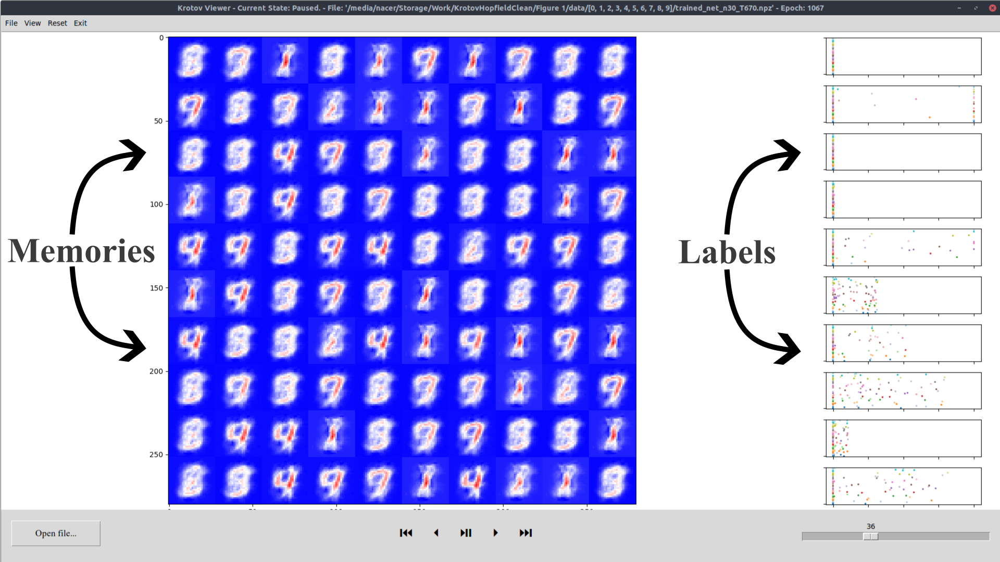

# Generalized Hopfield Network

Code, figures, movies, and examples for the [Waddington differentiation and saddle bifurcation for prototype learning](https://arxiv.org/) paper. 

## Installation

## Figures

## Modules

### The main module

Contains all the code necessary to run the network. 

If you are not inside the main_module directory, you must append the main_module directory to your path. For instance, if your working directory is on the same level as the main_module directory.

    import sys
    sys.path.append('../')

Then, use
    
    from main_module.KrotovV2 import *
    
to import network class.

#### Generating the network object

To generate the network object, use,

    net = KrotovNet()
    
the KrotovNet class contains 15 optional parameters (see demo/ for a working example).

#### System parameters

`Kx, Ky` define the size of your network; `Kx*Ky` is the total number of memories, individual `Kx` and `Ky` are used to plot the grid of memories. (DEFAULT: 10 $\times$ 10)

`n_deg` is the power on the dot product; $\langle M \vert A \rangle ^n$. (DEFAULT: 30)

`m_deg` is the power on the cost function. Generally, `m_deg` is set to the same value as `n_deg`. (DEFAULT: 30)

`M` is the number of training samples per miniBatchs. (DEFAULT: 1000)

`nbMiniBatchs` is the number of miniBatchs. (DEFAULT: 60)

`momentum` is the standard ML momentum; reapplies part of the previous time step (this is consistent with Krotov-Hopfield [paper](https://arxiv.org/abs/1606.01164)). (DEFAULT: 0.6)

`rate` is the learning rate used in training. (DEFAULT: 0.0008)

`temp` is the factor (sometimes written $T$) used to 'renormalize' computation; $\tanh \Big( \frac{\langle M \vert A \rangle ^n}{T} \Big) $. (DEFAULT: 600)

`rand_init_mean` is the mean of the normal distribution used to initialize the memories and labels. (DEFAULT: -0.03)

`rand_init_std` is the standard deviation of the normal distribution used to initialize the memories and labels. (DEFAULT: 0.03)

`initHiddenDetectors` is the input array you want to use as initial conditions instead of Gaussian for the labels/hidden detectors - if None, 
it uses Gaussian random initial condition. (DEFAULT: None)

`initVisibleDetectors` is the input array you want to use as initial conditions instead of Gaussian for the memories/visible detectors - if None, 
it uses Gaussian random initial condition. (DEFAULT: None)

`selected_digits` is an array which specifies the digits you want to include in the training data. (DEFAULT: [0, 1, 2, 3, 4, 5, 6, 7, 8, 9])

`useClipping` is a boolean which specifies whether you want to use clipping on the memory. If False, memories are normalized by dividing by the largest pixel greater than one, this is more practical analytically. (DEFAULT: False - i.e. uses normalization)

#### Training, plotting and saving

To train the network, use 

    net.train_plot_update(3500)

the only required argument is the number of epochs of training (for instance, 3500). Alternately, the following are the main optional arguments `isPlotting` plots the network at each epoch if True (DEFAULT: True), `isSaving` saves the network data (includes all epochs) if True (DEFAULT: False), `saving_dir` the directory in which to save the network (DEFAULT: None).

### The viewer module

If you choose to save the network data, the resulting .npz file can be read using the viewer module. 
    
    python KV_window.py 

The above (or equivalent for your python environment) starts the GUI. 

You can open any network training file using the "Open file..." button. The player allows for jump to the beginning of training (𐃏), move back by one frame (affected by speed) (⏴), play/pause (⏯), move forward by a frame (affected by speed) (⏵), or jump to the end (⏭). On the right, a slider can be used to change the speed at which training is played back.

### The nullcline module

### The simplified system module

